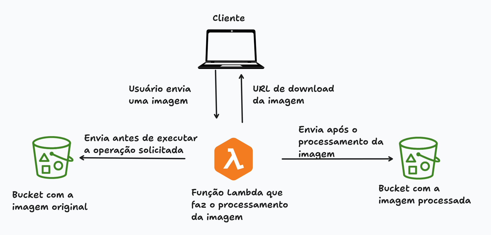

# Lazyditor - Editor de Imagens Serverless

## 1. Tecnologias Utilizadas

Este projeto implementa uma prova de conceito de um sistema de edição de imagens baseado em computação serverless, utilizando as seguintes tecnologias:

### Frontend

-    (Interface de usuário)

### Serverless

-  (Processamento serverless)
-  com  (Processamento de imagens)
-  (Armazenamento de arquivos)
-  (Endpoint HTTPS direto)

### Operações de Imagem Suportadas

- **Redimensionamento**: Alterar dimensões mantendo ou não a proporção
- **Conversão P&B**: Transformar imagens coloridas em escala de cinza
- **Thumbnail**: Gerar miniaturas com diferentes tamanhos
- **Melhoramento**: Ajustar brilho, contraste e saturação
- **Conversão PDF**: Transformar imagens em documentos PDF

## 2. Arquitetura da Solução



A arquitetura implementada segue o modelo serverless com os seguintes componentes:

1. **Frontend Web**: Interface de usuário responsiva com drag & drop para upload de imagens
2. **AWS Lambda Function**: Processamento serverless de imagens com Python e Pillow
3. **AWS S3 Buckets**: Armazenamento distribuído para arquivos originais e processados
4. **Function URLs**: Endpoint HTTPS direto sem necessidade de API Gateway

### Estrutura do Projeto

```
lazyditor/
├── lambda_function.py      # Código principal da Lambda
├── requirements.txt        # Dependências Python
├── index.html             # Frontend da aplicação
├── test-diagnostics.html  # Página de testes
├── README.md              # Este arquivo
└── assets/
    ├── icon.png           # Logo da aplicação
    └── demo-images/       # Imagens para teste
```

### Fluxo de Processamento

1. **Upload**: Usuário seleciona imagem e operação desejada
2. **Encoding**: Arquivo é convertido para Base64 no frontend
3. **Processamento**: Lambda recebe dados, processa imagem com Pillow
4. **Armazenamento**: Arquivos originais e processados são salvos em buckets S3 separados
5. **Download**: URLs pré-assinadas são geradas para download seguro (válidas por 1 hora)

## 3. Configuração da AWS Lambda

### Especificações da Function

```python
# Configurações de Runtime
Runtime: Python 3.11
Memory: 1024 MB
Timeout: 60 segundos
Architecture: x86_64

# Variáveis de Ambiente
ORIGINAL_BUCKET=lazyditor-original-files
PROCESSED_BUCKET=lazyditor-processed-files

### Layers Utilizadas

- Pillow Layer: Biblioteca de processamento de imagens Python
- Boto3 Layer: SDK da AWS para Python (incluído no runtime)
```

## 4. Operações de Processamento

### Redimensionamento de Imagem

```python
def resize_image(image_data, options, execution_logs):
    width = options.get('width', 800)
    height = options.get('height', 600)
    maintain_ratio = options.get('maintainRatio', True)

    image = Image.open(io.BytesIO(image_data))

    if maintain_ratio:
        image.thumbnail((width, height), Image.Resampling.LANCZOS)
    else:
        image = image.resize((width, height), Image.Resampling.LANCZOS)
```

### Conversão para Preto e Branco

```python
def image_to_blackwhite(image_data, options, execution_logs):
    image = Image.open(io.BytesIO(image_data))
    bw_image = image.convert('L')  # Converte para Grayscale
```

### Melhoramento de Imagem

```python
def enhance_image(image_data, options, execution_logs):
    brightness = options.get('brightness', 1.0)
    contrast = options.get('contrast', 1.0)
    saturation = options.get('saturation', 1.0)

    image = Image.open(io.BytesIO(image_data))

    if brightness != 1.0:
        image = ImageEnhance.Brightness(image).enhance(brightness)
    if contrast != 1.0:
        image = ImageEnhance.Contrast(image).enhance(contrast)
    if saturation != 1.0:
        image = ImageEnhance.Color(image).enhance(saturation)
```

## 4. Sistema de Logs e Monitoramento

### Logs de Execução em Tempo Real

A aplicação implementa um sistema completo de logs que acompanha cada etapa do processamento:

```javascript
// Logs exibidos na interface
[08:26:56] - 🚀 Lazyditor Lambda iniciada
[08:26:56] - 📥 Parseando dados da requisição...
[08:26:56] - 🔓 Decodificando arquivo Base64...
[08:26:56] - ✅ Arquivo decodificado: 2.1 MB
[08:26:56] - 💾 Salvando arquivo original...
[08:26:56] - 🔄 Iniciando processamento (resize-image)...
[08:26:56] - ✅ Processamento concluído em 0.32s
[08:26:56] - 💾 Salvando arquivo processado...
[08:26:56] - 🎉 Execução concluída com sucesso!
```

### CloudWatch Integration

- **Logs automáticos**: Todos os logs são enviados para CloudWatch
- **Métricas de performance**: Tempo de execução, uso de memória, erros
- **Alertas configuráveis**: Notificações para falhas ou alta latência

### Validações de Entrada

- **Tipos de arquivo**: Suporte apenas para JPEG, PNG e GIF
- **Tamanho máximo**: 25MB por arquivo
- **Validação Base64**: Verificação de integridade dos dados
- **Parâmetros obrigatórios**: Validação de operation, fileName e fileData

## 5. Como Acessar e Testar a Aplicação

### Versão Web

Você pode acessar diretamente a aplicação hospedada:

🌐 **[Abrir Lazyditor Web](https://lazyditor.com.br)**

---

### Aplicativo Android

Também é possível utilizar a versão mobile em dispositivos Android:

📦 **[Baixar Lazyditor APK](https://github.com/thiagojorgelins/lazyditor-serverless/releases/download/v0.0.1/lazyditor-0.0.1.apk)**

---

### Rodar Localmente com Docker

#### Pré-requisitos

- Docker
- Docker Compose

#### Instruções

1. **Subir o ambiente local**:

   ```bash
   docker compose up -d
   ```

2. **Acessar a aplicação no navegador**:

   ```
   http://localhost:8080
   ```
